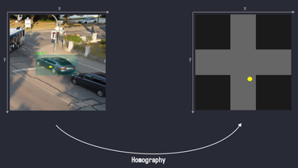
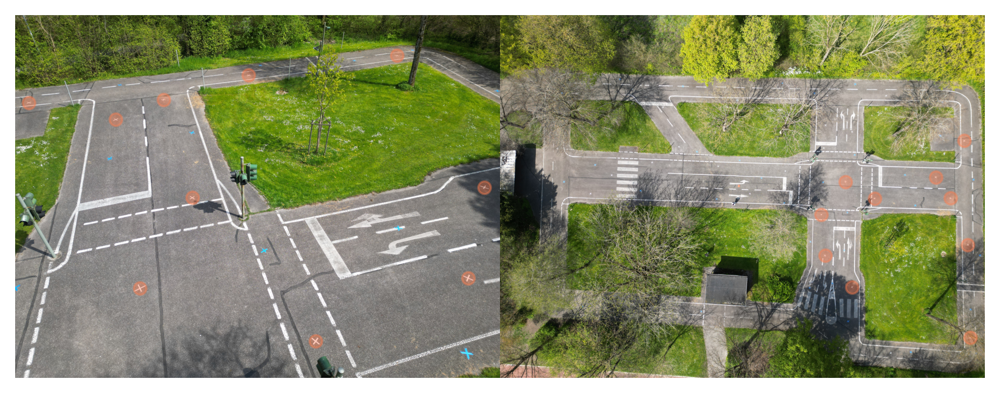
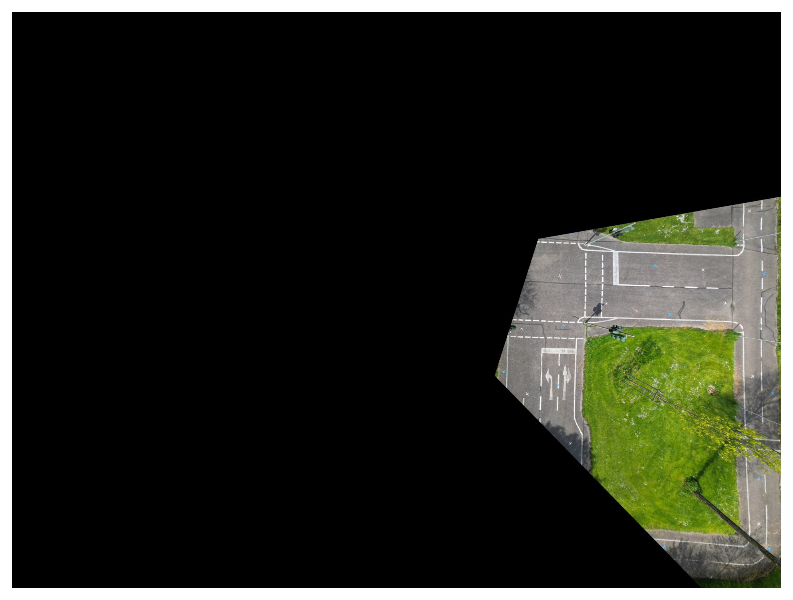

# ToDo
- Scaling factor genauer bestimmen
- Camera Calibration?
- DataTypes Code Refactor
- Bei Reprojection_error.png -> add the error next to point as text?

# Quick Camera Calibration
A camera capturing the real world, projects objects from a 3-
dimensional scene onto a 2-dimensional image. Naturally, this
projection loses information about the characteristics of the
scene. However, given certain assumptions, we can describe
certain objects in the real world sufficient enough to obtain a
bi-directional mapping between world- and camera coordinates. 

A homography assumes a planar scene, but allows for a bi-directional mapping.
In this work, we calculate a homography matrix $\mathbf{H}$ between a `top-view` 
and several `perspective-views` to produce this mapping of object- $x_o$,
and world coordinates $x_w$. Then, given $\mathbf{H}$, we can project points 
captured by cameras on the scene, easily via $x_w = \mathbf{H}x_o$. Note that
we can only map points lying on the ground, as we have the planar assumption. 
Given a ground-contact point of a car, or pedestrian, we can then map his 
position to world-coordinates, quite easily.



Obviously this assumption of a planar scene does not hold in the real world.
In this work, we want to examine how big of an error we can expect when
using a homography to transform points from camera to world coordinates.
With this approach we can calculate homographies quite fast to obtain
$\mathbf{H}$,the **cameras extrinsics** $R, t$, and also the *effective* FoV of 
a given camera. 

## Usage
* `src/exec_experiments.py` produces the results of an experiment for a given
perspective view. Those results include:
    - `fov_pts_pv.txt` *Field-Of-View (FoV) points of a perspective-view*
    - `fov_pts_tv.txt` *Field-Of-View (FoV) points transformed to the top-view*
    - `fov.png` *An image illustrating the FoV of a camera and its position in world coordinates*
    - `homography_result.png` *Visualizing an Homography matrix*
    - `homography.txt` *Homography matrix* 
    - `ref_pts_pv.txt` *Reference points from the perspective view, used to calculate $\mathbf{H}$*
    - `ref_pts_tv.txt` *Corresponding reference points from the top-view, used to calculate $\mathbf{H}$*
    - `ref_pts.png` *An image illustrating the used reference points*
    - `reprojection_error.png` *An image illustrating the validation points and calculated reprojection error* 
    - `summary.txt` *An Summary of the experiment* 
    - `val_pts_pv.txt` *Validation points of the perspective view*
    - `val_pts_tv.txt` *Validation points of the top view*
    - `val_pts_pv_transformed.txt` *Validation points transformed from perspective to top view*
* `src/set_reference_points.py` is a helper script to help producing a set of reference points 
between top- and perspective view.
    - *set variables `fname_pv_img` and `fname_tv_img` to perspective and corresponding top-view*
    - *set `dirname_output` to adjust output directory*
* `src/set_fov_points.py` is a helper script to help producing a set of FoV points
for a perspective view.
    - *set variable `fname_pv_img` to perspective view*
    - *set variable `fname_output` to adjust output filename*
* `src/make_config_files.py` is a helper script to help producing the config files
in the `conf` folder.
    - *adjust `ref_pts`, and `val_pts` you want to use for each config as needed*
* `src/make_table_from_results.py` is a helper script to help producing a summarizing table
of the results from the experiments.

# Methodology
## Dataset
Our used dataset can be found [here](https://drive.google.com/file/d/1pFw88O86T1jonxGKzLOJleYC9u0qIgv-/view?usp=share_link). However, you can easily create your own dataset.
- set `base_url` in `scripts/make_config.py`
- execute `scripts/make_config.py`. This creates the `conf/config.yaml` file. 
You can also manually change the paths to the files.

## File Structure:
- `homography_evaluation/`
    - `annotations/`
        - `DJI_0017_blue.txt` *(top view)*
        - `DJI_0017_white.txt` 
        - `DJI_0026_blue.txt` *(perspective view)*
        - `DJI_0026_white.txt`
        - `DJI_0026_fov_pts.txt`
        - ...
        - `visualized/`
            - `DJI_0017_figure.jpg`
            - `DJI_0026_figure.jpg`
            - ...
    - `data/`
        - `calibration/`
            - `DJI_003.JPG` *(Calibration images)*
            - ...
            - `mini3.json` *(Internal calibration matrix $K$)*
        - `perspective_views/`
            - `DJI_0026.JPG`
            - `DJI_0029.JPG`
            - ...
        - `top_view/`
            - `DJI_0017.JPG`

### Top View


### Perspective View Example

An example of a perspective view.


# Results
| Image        | Error [cm]  |  Variance [cm]  | Std [cm]     | sample_size [#] | distances [cm] |
| ------------ | ----------: | ----------: | -------: | -----------:| :---: |
| **DJI_0026.JPG** | 6.40 | 0.10 | 3.13 | 6 | {'b6': 9.35, 'b7': 5.28, 'b8': 4.25, 'b9': 11.62, 'b19': 5.51, 'b21': 2.41} |
| **DJI_0029.JPG** | 6.46 | 0.06 | 2.43 | 11 | {'b19': 11.46, 'b21': 4.93, 'b22': 5.74, 'b23': 8.35, 'b20': 6.2, 'b28': 3.94, 'b27': 5.77, 'b32': 4.03, 'b34': 10.35, 'b33': 6.13, 'b24': 4.14} |
| **DJI_0032.JPG** | 5.27 | 0.27 | 5.19 | 9 | {'b16': 3.18, 'b15': 3.84, 'b14': 1.26, 'b12': 0.28, 'b11': 1.95, 'b10': 6.39, 'b1': 16.67, 'b2': 11.82, 'b13': 2.05} |
| **DJI_0035.JPG** | 9.00 | 0.54 | 7.38 | 18 | {'b28': 0.99, 'b27': 8.89, 'b20': 2.53, 'b18': 4.42, 'b21': 8.12, 'b19': 2.7, 'b7': 31.44, 'b6': 10.4, 'b5': 13.0, 'b3': 8.45, 'b4': 7.49, 'b13': 4.08, 'b11': 23.68, 'b12': 7.1, 'b14': 4.36, 'b15': 8.53, 'b16': 4.64, 'b17': 11.25} |
| **DJI_0038.JPG** | 7.22 | 0.25 | 4.98 | 14 | {'b20': 2.55, 'b18': 3.99, 'b17': 11.17, 'b16': 7.06, 'b15': 13.69, 'b14': 1.09, 'b13': 9.82, 'b12': 4.98, 'b11': 0.88, 'b10': 5.83, 'b3': 19.1, 'b4': 5.03, 'b5': 11.01, 'b6': 4.92} |
| **DJI_0045.JPG** | 58.91 | 28.61 | 53.49 | 3 | {'b10': 30.95, 'b12': 12.02, 'b25': 133.77} |
| **DJI_0049.JPG** | 12.22 | 1.31 | 11.45 | 18 | {'b12': 1.39, 'b13': 9.11, 'b14': 15.9, 'b15': 8.0, 'b16': 9.37, 'b17': 1.65, 'b18': 15.81, 'b19': 8.89, 'b20': 7.09, 'b21': 9.38, 'b22': 1.5, 'b23': 2.39, 'b24': 39.58, 'b4': 6.0, 'b5': 8.72, 'b6': 6.61, 'b8': 32.53, 'b9': 36.05} |
| **DJI_0053.JPG** | 32.29 | 6.30 | 25.10 | 12 | {'b1': 6.41, 'b2': 25.86, 'b3': 38.37, 'b4': 7.01, 'b5': 67.55, 'b6': 46.97, 'b7': 86.1, 'b12': 6.18, 'b13': 41.27, 'b14': 16.13, 'b15': 40.36, 'b16': 5.31} |
| **DJI_0061.JPG** | 8.24 | 0.15 | 3.83 | 10 | {'b3': 4.97, 'b4': 9.9, 'b13': 10.48, 'b14': 3.55, 'b15': 16.91, 'b16': 4.34, 'b17': 5.79, 'b27': 9.9, 'b28': 6.44, 'b29': 10.15} |
| **DJI_0066.JPG** | 9.68 | 0.90 | 9.48 | 13 | {'b18': 2.69, 'b19': 2.8, 'b21': 3.2, 'b22': 6.19, 'b20': 6.05, 'b27': 1.67, 'b28': 8.2, 'b29': 12.26, 'b30': 21.99, 'b31': 6.35, 'b32': 1.6, 'b33': 18.02, 'b34': 34.86} |
| **DJI_0067.JPG** | 7.29 | 0.32 | 5.70 | 6 | {'b8': 6.05, 'b9': 12.9, 'b19': 4.74, 'b21': 1.97, 'b22': 1.26, 'b23': 16.82} |
| **DJI_0078.JPG** | 7.58 | 0.23 | 4.80 | 18 | {'b4': 5.89, 'b6': 5.26, 'b10': 10.37, 'b11': 2.33, 'b12': 2.99, 'b13': 6.88, 'b14': 1.38, 'b15': 9.56, 'b16': 3.82, 'b17': 17.33, 'b18': 6.28, 'b19': 6.74, 'b20': 4.02, 'b21': 15.48, 'b22': 15.14, 'b27': 13.37, 'b28': 2.17, 'b29': 7.51} |

Q: Why is std bigger than var? Because values <1, they are calculated on [m], not [cm].

# Example output (images) of DJI_0029
## Input
TODO

## Used Reference Points


## Reprojection Error


## FoV


## Homography Result


## Example for `homography.txt`
```
-2.471005323589670344e-01 2.202777572374387649e+00 5.449373751702861227e+03
7.838380620280147593e-01 1.488932913102582356e+00 7.223801048885372893e+02
9.477584996286105389e-07 1.120928645827416704e-03 1.000000000000000000e+00
```

## Example for `fov_pts_pv.txt`, `fov_pts_tv.txt`
```
1 43.68181818181836 3013.681818181818
2 43.68181818181836 624.5909090909086
3 3340.9545454545464 248.22727272727207
4 4028.2272727272734 493.68181818181756
5 4003.6818181818194 3005.5
```

## Example for `ref_pts_pv.txt`, `ref_pts_tv.txt`
```
w19 1037.1823948777442 2276.8901843213566
w20 2497.796956616427 2718.1374020605404
w21 1472.1995910350036 1521.7797453525168
w22 835.832076479681 869.5986103466737
w23 1233.2133403558225 704.465531378676
w24 1941.9513986318193 500.8437548831219
w25 3766.6288625543943 2191.973699380851
w26 3901.9315967141156 1435.111944499295
w28 3174.550479304811 337.40767375073295
w9 113.83397250604983 729.4318554126189
```

## Example for `val_pts_pv.txt`, `val_pts_tv.txt`, `val_pts_pv_transformed.txt`
```
b19 1.9416702190787873 2272.6675351010595
b20 2070.8630806403717 1962.4439757638122
b21 785.2808082636703 1195.007793952923
b22 1470.3724566773062 979.4376934045443
b23 869.7473430641534 581.1160037452446
b24 2038.4806606158206 418.01647400462673
b27 3758.8027896313965 2817.548793820006
b28 3186.7413138752913 1775.7783324148659
b32 4010.95949128866 630.0095785026731
b33 2820.050896504055 378.0788235457319
b34 3304.0052996194418 290.8976999687683
```

## Example for `summary.txt`
```
mean_distance;0.064582
variance;0.000590
std;0.024290
sample_size;11
distances;{'b19': 0.11460167058419983, 'b21': 0.049302997671067925, 'b22': 0.05738097470436004, 'b23': 0.08348829323163144, 'b20': 0.062018662040715794, 'b28': 0.039390496489356046, 'b27': 0.05771559674444716, 'b32': 0.04025792262934437, 'b34': 0.10352593205400389, 'b33': 0.061339368591459865, 'b24': 0.04138225681535594}
```